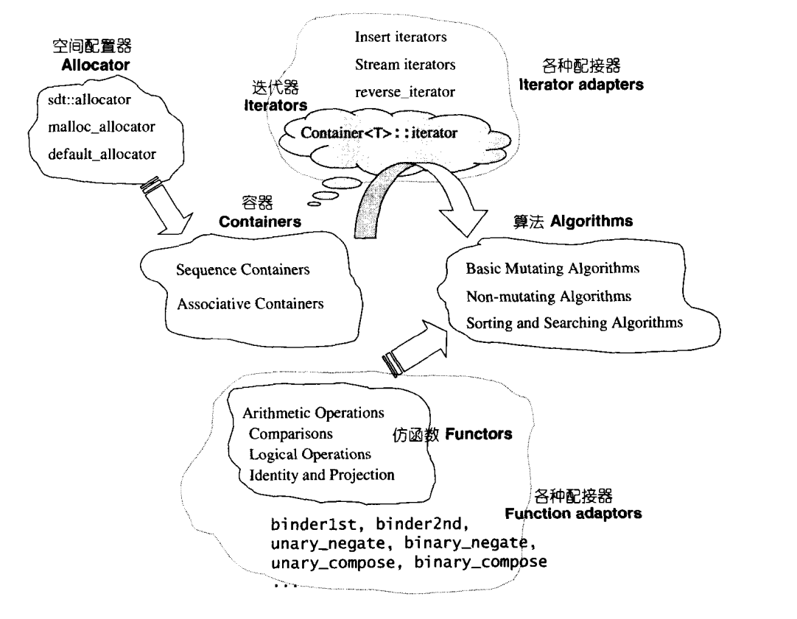
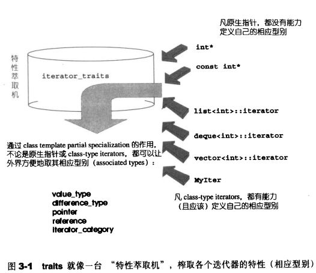

## 迭代器设计

`iterator`:
**一种能够顺序访问容器中每个元素的方法，使用该方法不能暴露容器内部的表达式。类型萃取技术主要是为了解决和`iterator`相关的问题。**
对于迭代器来说就是一种智能指针，因此，它也就拥有了一般指针的所有特点——能够对其进行*和->操作。
```cpp
template<class _Tp>
struct iterator_traits<_Tp*>
{
    typedef ptrdiff_t difference_type;
    typedef typename _Tp::value_type value_type;
    typedef typename _Tp::pointer pointer;
    typedef typename _Tp::reference reference;
    typedef typename _Tp::iterator_category iterator_category;
};
```
### `template`参数推导
在算法中使用迭代器时，很可能会用到相应型别。
假设算法中有一个必要声明变量，以"迭代器所指对象的型别"为型别，如何解决？
**利用` function template` 的参数推导机制。**
例如：
如果 T 是某个指向特定对象的指针，那么在 func 中需要指针所指向对象的型别的时候，怎么办呢？这个还比较容易，模板的参数推导机制可以完成任务，
```cpp
template <class I>
inline
void func(I iter) {
    func_impl(iter, *iter); // 传入iter和iter所指的值，class自动推导
}
```
通过模板的推导机制，我们轻而易举的或得了指针所指向的对象的类型。
```cpp
template <class I, class T>
void func_impl(I iter, T t) {
        T tmp; // 这里就是迭代器所指物的类别
        // ... 功能实现
}

int main() {
    int i;
    func(&i);
}
```
### 声明内嵌型别
迭代器所指对象的型别，称之为迭代器的`value type`。
在`func_impl`中，我们可以将`T`作为函数的返回值，但问题在于用户需要调用的为`func`.
```cpp
template <class I, class T>
T func_impl(I iter, T t){
  T tmp; // 这里就是迭代器所指物的类别
  // ... 功能实现
}

template <class T>
(*T) func(T t) { // !!!Wrong code
    return func_impl(t, *t); // forward the task to func_impl
}
int main() {
    int i  =10;
	cout<<func(&i)<<endl; // !!! Can’t pass compile
}
```
上述代码存在问题，无法编译通过，可以修改为：
```cpp
template <class T>
struct MyIter {
    typedef T value_type; // 内嵌型别声明
    T* ptr;
    MyIter(T* p = 0) : ptr(p) {}
    T& operator*() const { return *ptr; }
};

template <class I>
typename I::value_type
func(I ite) {
	std::cout << "class version" << std::endl;
    return *ite;
}
int main() {
    // ...
    MyIter<int> ite(new int(8));
    cout << func(ite);	// 输出8
}
```
很漂亮的解决方案，看上去一切都很完美。但是，实际上还是有问题，因为 func 如果是一个泛型算法，那么它也绝对要接受一个原生指针作为迭代器，但是显然，你无法让下面的代码编译通过：
```cpp
int *p = new int(5);
cout<<func(p)<<endl; // error
```
### `Traits`
直接使用typename I::value_type，算法就无法接收原生指针，因为原生指针根本就没有 value_type 这个内嵌类型。
需要加入一个中间层对其进行判断，看它是不是原生指针，注意，这就是 traits 技法的妙处所在。
#### 函数偏特化
```cpp
#include <iostream>

template <class T>
struct MyIter {
  typedef T value_type;  //声明内嵌类型
  T*        ptr;
  MyIter(T* p = nullptr) : ptr(p) {
  }
  T& operator*() {
    return *ptr;
  }
};

template <class I>
typename I::value_type func(I ite) {
  std::cout << "class version" << std::endl;
  return *ite;
}

template <class I>
I func(I* ite) {
  std::cout << "pointer version" << std::endl;
  return *ite;
}

template <class I>
I func(const I* ite) {
  std::cout << "const pointer version" << std::endl;
  return *ite;
}

int main() {
  MyIter<int> ite(new int(8));
  std::cout << func(ite) << std::endl;
  int* p = new int(52);
  std::cout << func(p) << std::endl;
  const int k = 3;
  std::cout << func(&k) << std::endl;
}
```
### 加入中间层

利用一个中间层iterator_traits固定了func的形式，使得重复的代码大量减少，唯一要做的就是稍稍特化一下 iterator_tartis 使其支持 pointer 和 const pointer:
```cpp
#include <iostream>

template <class T>
struct MyIter {
  typedef T value_type;  //声明内嵌类型
  T*        ptr;
  MyIter(T* p = nullptr) : ptr(p) {
  }
  T& operator*() {
    return *ptr;
  }
};

// class type
template <typename T>
struct iterator_traits {
  typedef typename T::value_type value_type;
};

// 偏特化1
template <typename T>
struct iterator_traits<T*> {
  typedef T value_type;
};

// 偏特化2
template <class T>
struct iterator_traits<const T*> {
  typedef T value_type;
};

template <class I>
typename iterator_traits<I>::value_type
// 首先询问iterator_traits<I>::value_type,如果传递的I为指针,则进入特化版本,iterator_traits直接回答;如果传递进来的I为class
// type,就去询问T::value_type.
func(I ite) {
  std::cout << "normal version" << std::endl;
  return *ite;
}
int main() {
  // ...
  MyIter<int> ite(new int(8));
  std::cout << func(ite) << std::endl;
  int* p = new int(52);
  std::cout << func(p) << std::endl;
  const int k = 3;
  std::cout << func(&k) << std::endl;
}
```
总结：通过定义内嵌类型，我们获得了知晓 iterator 所指元素类型的方法，通过 traits 技法，我们将函数模板对于原生指针和自定义 iterator 的定义都统一起来，我们使用 traits 技法主要是为了解决原生指针和自定义 iterator 之间的不同所造成的代码冗余，这就是 traits 技法的妙处所在。

