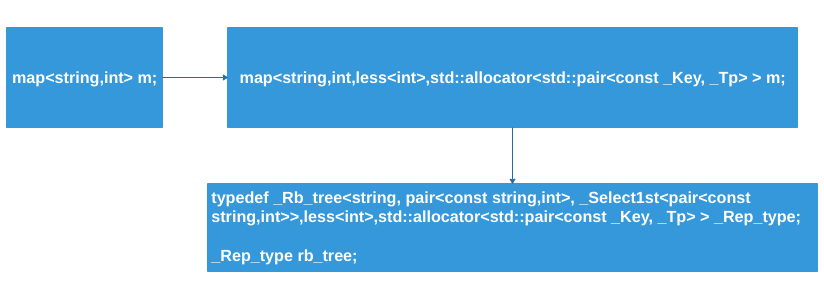

map/multimap 以rb_tree为底层结构，因此有元素自动排序特点，排序的依据是key。
map/multimap提供"遍历"操作及iterators。按正常规则(++iter)遍历，便能够获得排序状态。
我们无法使用map/multimap的iterators改变元素的key(因为key有其严谨排列规则)，但可以用它来改变元素的data。因此map/multimap内部自动将用户指定的key type设定为const，如此便能进制用户对元素key的赋值。
map元素的key必须独立无二，因此其insert使用的是rb_tree的_M_insert_unique()，而multimap元素的key可以重复，因此其insert使用的是rb_tree的_M_insert_equal()。

对于本节，我们将从下面几个内容阐述：

map的key为key,value为key+data,与set是不同的，set是key就是value，value就是key。
map的key不可修改,map与multimap的插入调用函数不同，影响了其key是否对应value。
initializer_list使用
map有`[]`操作符，而multimap没有`[]`操作符。
1. map
`key为key，value为key+data`
下面`map`中我们可以看到`value_type`为一个`pair`。
```cpp
template <typename _Key, typename _Tp, typename _Compare = std::less<_Key>,
typename _Alloc = std::allocator<std::pair<const _Key, _Tp> > >
class map
{
public:
    typedef _Key                                          key_type;
    typedef _Tp                                           mapped_type;
    typedef std::pair<const _Key, _Tp>                    value_type;
    typedef _Compare                                      key_compare;
    typedef _Alloc                                        allocator_type;
private:
    // key为key,value为key+data
    typedef _Rb_tree<key_type, value_type, _Select1st<value_type>,
            key_compare, _Pair_alloc_type> _Rep_type;

    /// The actual tree structure.
    _Rep_type _M_t;
};
```

上述默认的仿函数为_Select1st，我们在stl_function中看到源码如下：
```cpp
template<typename _Pair>
struct _Select1st
: public unary_function<_Pair, typename _Pair::first_type>
{
    typename _Pair::first_type&
    operator()(_Pair& __x) const
    { return __x.first; }
};
```
key不能改，data可以改


