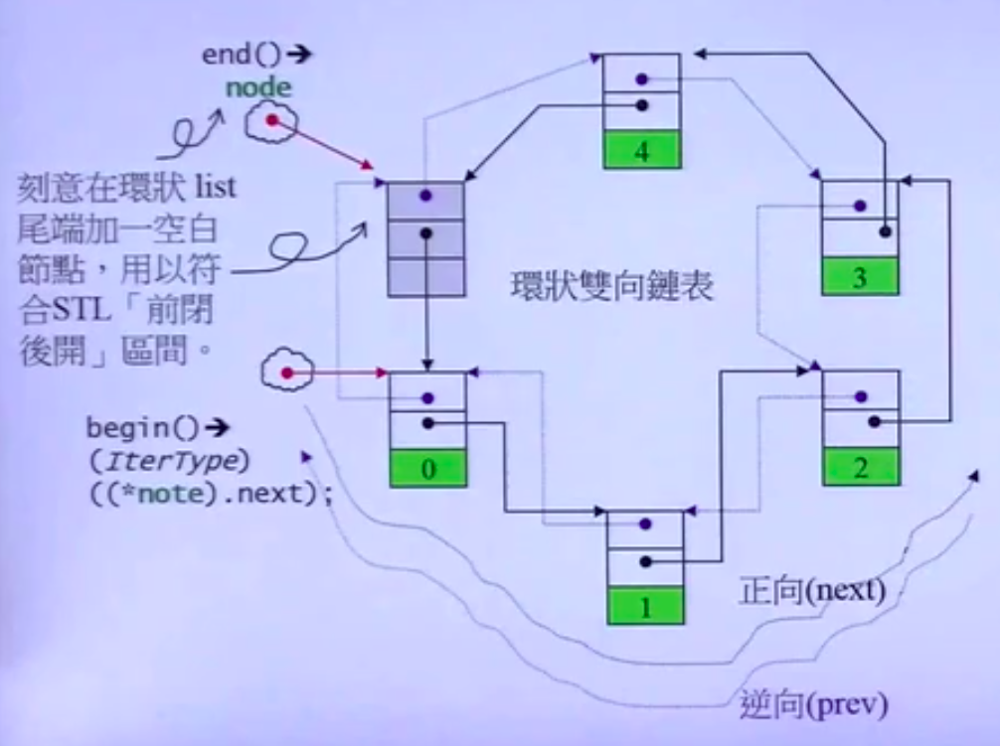

## `list`双向环形列表

### `list`源码
类结构:
```cpp
template <typename _Tp, typenmae _Alloc=std::allocator<_Tp>>
class list : proteced _List_base<_Tp,_Alloc>{}
```
构造函数
1. 不带任何元素的`list`
```cpp
explicit list(const allocator_type &__a) _GLIBCXX_NOEXCEPT: _Base(_Node_alloc_type(__a)) {
}
```
2. 带有`n`个元素且赋初值的list
```cpp
explicit list(size_type __n, const value_type &__value = value_type(),const allocator_type &__a = allocator_type()) : _Base(_Node_alloc_type(__a)) {
   _M_fill_initialize(__n, __value); 
}
```


