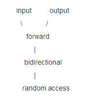
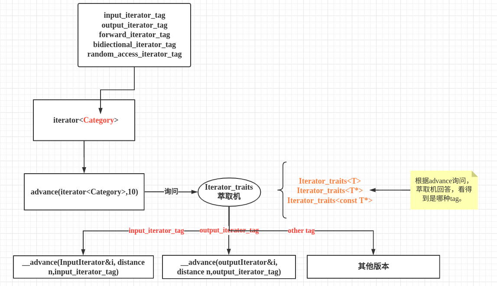

迭代器是指向序列元素的指针的一种抽象。通过使用迭代器，我们可以访问序列中的某个元素、改变序列中的某个元素的值、使迭代器向前或向后行走等等。

迭代器有常见有五种类型: `value_type, difference_type, reference_type,` `pointer_type`都比较容易在` traits` 和相应偏特化中提取。

但是，`iterator_category`一般也有5个，这个相应型别会引发较大规模的写代码工程。

单向移动只读迭代器` Input Iterator`
单向移动只写迭代器 `Output Iterator`
单向移动读写迭代器` Forward Iterator`
双向移动读写迭代器` Bidirectional Iterator`


定义如下`tag`:
```cpp
struct input_iterator_tag {};
struct output_iterator_tag {};
struct forward_iterator_tag : public input_iterator_tag {};
struct bidirectional_iterator_tag : public forward_iterator_tag {};
struct random_access_iterator_tag : public bidirectional_iterator_tag {};

// 继承的好处就是，当函数需要用 input_iterator_tag 的时候
// 假设你传进一个forward_iterator_tag，它会沿继承向上找，知道符合条件
```
声明了一些列 tag 之后，我们就可以重载 advance函数，我们把这些函数用下滑线来定义，表示在内部使用，外部不可见。
```cpp
template <typename inputIterator, class distance>
inline void __advance(inputIterator &i, distance n, input_iterator_tag) {
  std::cout << "Input tag" << std::endl;
}

template <typename outputIterator, class distance>
inline void __advance(outputIterator &i, distance n, output_iterator_tag) {
  std::cout << "outputIterator tag" << std::endl;
}

template <typename forwardIterator, typename distance>
inline void __advance(forwardIterator &i, distance n, forward_iterator_tag) {
  std::cout << "forward_iterator_tag" << std::endl;
}

template <typename BidiectionalIterator, typename distance>
inline void __advance(BidiectionalIterator &i,
                      distance              n,
                      bidirectional_iterator_tag) {
  std::cout << "bidirectional_iterator_tag" << std::endl;
}

template <typename RandomAccessIterator, typename distance>
inline void __advance(RandomAccessIterator &i,
                      distance              n,
                      random_access_iterator_tag) {
  std::cout << "random_access_iterator_tag" << std::endl;
}
```
定义萃取机
```cpp
// traits 型别
template <class T>
struct Iterator_traits {
  typedef typename T::iterator_category iterator_category;
};

// 针对原生指针的偏特化
template <class I>
struct Iterator_traits<I *> {
  typedef random_access_iterator_tag iterator_category;
};

template <typename I>
struct Iterator_traits<const I *> {
  typedef random_access_iterator_tag iterator_category;
};
```
对外暴露接口
```cpp
// 对外接口
template <typename InputIterator, typename Distance>
inline void advance(InputIterator &i, Distance n) {
  // 通过Ierator_traits询问它的iterator_category是谁
  typedef typename Iterator_traits<InputIterator>::iterator_category category;
  __advance(i, n, category());  // 各类型的重载
}
```
定义`calss_type`:
```cpp
// 定义class type
template <typename Category>
struct iterator {
  typedef Category iterator_category;
};
```
测试：
```cpp
int main() {
  iterator<input_iterator_tag>         input;
  iterator<output_iterator_tag>        output;
  iterator<forward_iterator_tag>       forward;
  iterator<bidiectional_iterator_tag>  bidect;
  iterator<random_access_iterator_tag> random;
  advance(input, 10);
  advance(output, 10);
  advance(forward, 10);
  advance(bidect, 10);
  advance(random, 10);
  int *p = NULL;
  advance(p, 10);
  return 0;
}
```
如何获取`advance`的返回值类型：
```cpp
// 对外接口
template<class InputIterator, class Distance>
inline typename Iterator_traits<InputIterator>::iterator_category
advance(InputIterator &i, Distance n) {
    // 通过Ierator_traits询问它的iterator_category是谁
    typedef typename Iterator_traits<InputIterator>::iterator_category category;
    return __advance(i, n, category()); // 各型别的重载
}
```
内部重载修改：
```cpp
// input iterator
template<class inputIterator, class distance>
inline typename Iterator_traits<inputIterator>::iterator_category
__advance(inputIterator &i, distance n,
          input_iterator_tag) {
    std::cout << "input tag" << std::endl;
    return input_iterator_tag();
}

// output iterator
template<class outputIterator, class distance>
inline typename Iterator_traits<outputIterator>::iterator_category
__advance(outputIterator &i, distance n,
          output_iterator_tag) {
    std::cout << "output tag" << std::endl;
    return output_iterator_tag();
}

// forward iterator
template<class ForwardIterator, class Distance>
inline typename Iterator_traits<ForwardIterator>::iterator_category
__advance(ForwardIterator &i, Distance n,
          forward_iterator_tag) {
    std::cout << "forward tag" << std::endl;
    return forward_iterator_tag();
}

// bidrectional iterator
template<class BidiectionalIterator, class Distance>
inline typename Iterator_traits<BidiectionalIterator>::iterator_category
__advance(BidiectionalIterator &i, Distance n,
          bidiectional_iterator_tag) {
    std::cout << "bidrectional tag" << std::endl;
    return bidiectional_iterator_tag();
}

// RandomAccess iterator
template<class RandomAccessIterator, class Distance>
inline typename Iterator_traits<RandomAccessIterator>::iterator_category
__advance(RandomAccessIterator &i, Distance n,
          random_access_iterator_tag) {
    std::cout << "randomaccess tag" << std::endl;
    return random_access_iterator_tag();
}
```
### `STL源码剖析Iterator`
1. `tag`
```cpp
 ///  Marking input iterators.
  struct input_iterator_tag { };

  ///  Marking output iterators.
  struct output_iterator_tag { };

  /// Forward iterators support a superset of input iterator operations.
  struct forward_iterator_tag : public input_iterator_tag { };

  /// Bidirectional iterators support a superset of forward iterator
  /// operations.
  struct bidirectional_iterator_tag : public forward_iterator_tag { };

  /// Random-access iterators support a superset of bidirectional
  /// iterator operations.
  struct random_access_iterator_tag : public bidirectional_iterator_tag { };
```
2. 萃取机
```cpp
template<typename _Iterator>
struct iterator_traits
{
  typedef typename _Iterator::iterator_category iterator_category;
  typedef typename _Iterator::value_type        value_type;
  typedef typename _Iterator::difference_type   difference_type;
  typedef typename _Iterator::pointer           pointer;
  typedef typename _Iterator::reference         reference;
};
```
3. `iterator`
```cpp
template<typename _Category, typename _Tp, typename _Distance = ptrdiff_t,
       typename _Pointer = _Tp*, typename _Reference = _Tp&>
struct iterator
{
  /// One of the @link iterator_tags tag types@endlink.
  typedef _Category  iterator_category;
  /// The type "pointed to" by the iterator.
  typedef _Tp        value_type;
  /// Distance between iterators is represented as this type.
  typedef _Distance  difference_type;
  /// This type represents a pointer-to-value_type.
  typedef _Pointer   pointer;
  /// This type represents a reference-to-value_type.
  typedef _Reference reference;
};
```
