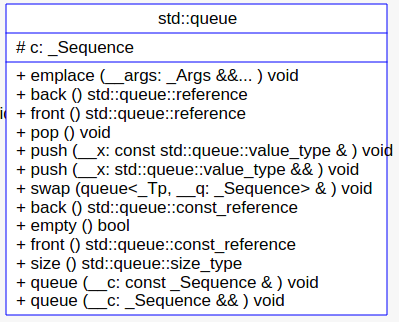

## `stack`
在`stack`的源码中主要关注一下两点：
* 默认`_Sequence`为`deque`;
* 内部实现函数是调用`_Sequence`对应容器的函数。


```cpp
template <typename _Tp, typename _Sequence = deque<_Tp>>
class stack {
public:
  typedef _Sequence::value_type      value_type;
  typedef _Sequence::reference       reference;
  typedef _Sequence::const_reference const_reference;
  typedef _Sequence::size_type       size_type;
  typedef _Sequence                  container_type;

protected:
  _Sequence c;

public:
  reference top() {
    _glibcxx_requries_noempty();
    return c.back();
  }

  void push_back(const value_type &__x) {
    c.push_back(__x);
  }
};
```
对`stack`来说，底层容器可以是`vector, list, deque`,但不能为`map, set`。
```cpp
#include <ctime>
#include <deque>
#include <iostream>
#include <list>
#include <stack>
#include <vector>

void test_stack() {
  std::cout << "============test_stack=============" << std::endl;
  clock_t                         timeStart = clock();
  std::stack<int, std::list<int>> c;
  for (long i = 0; i < 100000; i++) c.push(i + 1);
  std::cout << "stack.size()= " << c.size() << std::endl;
  std::cout << "stack.top()= " << c.top() << std::endl;
  c.pop();
  std::cout << "stack.size()= " << c.size() << std::endl;
  std::cout << "stack.top()= " << c.top() << std::endl;
  std::cout << "use stack milli-seconds : " << (clock() - timeStart)
            << std::endl;

  timeStart = clock();
  std::stack<int, std::deque<int>> c1;
  for (long i = 0; i < 100000; i++) c1.push(i + 1);
  std::cout << "stack.size()= " << c1.size() << std::endl;
  std::cout << "stack.top()= " << c1.top() << std::endl;
  c1.pop();
  std::cout << "stack.size()= " << c1.size() << std::endl;
  std::cout << "stack.top()= " << c1.top() << std::endl;
  std::cout << "use stack milli-seconds : " << (clock() - timeStart)
            << std::endl;

  // vector可以作为stack的底层容器
  std::stack<int, std::vector<int>> c2;
  for (long i = 0; i < 100000; i++) c2.push(i + 1);
  std::cout << "stack.size()= " << c2.size() << std::endl;
  std::cout << "stack.top()= " << c2.top() << std::endl;
  c2.pop();
  std::cout << "stack.size()= " << c2.size() << std::endl;
  std::cout << "stack.top()= " << c2.top() << std::endl;
  std::cout << "use stack milli-seconds : " << (clock() - timeStart)
            << std::endl;
}

int main(int argc, char **argv) {
  test_stack();
}
```
### `queue`
在`queue`中主要关注：
* 默认`_Sequeue`为`deque`;
* 内部实现函数为`_Sequeue`的内部函数。

```cpp
template <typename _Tp, typename _Sequence = deque<_Tp>>
class queue {
public:
  typedef _Sequence::value_type      value_type;
  typedef _Sequence::reference       reference;
  typedef _Sequence::const_reference const_reference;
  typedef _Sequence::size_type       size_type;
  typedef _Sequence                  container_type;

protected:
  _Sequence c;

public:
  void pop() {
    _glibcxx_requries_noempty();
    c.pop_front();
  }

  void push(const value_type &__x) {
    c.push_back(__x);
  }
};
```

优先队列使用`vector`作为容器：
```cpp
template<typename _Tp, typename _Sequence = vector<_Tp>,
typename _Compare  = less<typename _Sequence::value_type> >
class priority_queue
{
public:
    typedef typename _Sequence::value_type                value_type;
    typedef typename _Sequence::reference                 reference;
    typedef typename _Sequence::const_reference           const_reference;
    typedef typename _Sequence::size_type                 size_type;
    typedef          _Sequence                            container_type;

protected:
    //  See queue::c for notes on these names.
    _Sequence  c;
    _Compare   comp;

public:
    reference
    top() 
    {
	    __glibcxx_requires_nonempty();
	    return c.front();
    }

    void
    push(const value_type& __x)
    {
	    c.push_back(__x);
	    std::push_heap(c.begin(), c.end(), comp);
    }

}
```

`queue`的底层容器可以为`deque, list`但不能为`vector, map, set`.
```cpp
#include <ctime>
#include <deque>
#include <iostream>
#include <list>
#include <queue>
#include <vector>

void test_queue() {
  std::cout << "============test_queue=============" << std::endl;
  clock_t                         timeStart = clock();
  std::queue<int, std::list<int>> c;
  for (long i = 0; i < 100000; i++) c.push(i + 1);
  std::cout << "queue.size()= " << c.size() << std::endl;
  std::cout << "queue.front()= " << c.front() << std::endl;
  c.pop();
  std::cout << "queue.size()= " << c.size() << std::endl;
  std::cout << "queue.front()= " << c.front() << std::endl;
  std::cout << "use queue milli-seconds : " << (clock() - timeStart)
            << std::endl;

  timeStart = clock();
  std::queue<int, std::deque<int>> c1;
  for (long i = 0; i < 100000; i++) c1.push(i + 1);
  std::cout << "queue.size()= " << c1.size() << std::endl;
  std::cout << "queue.front()= " << c1.front() << std::endl;
  c1.pop();
  std::cout << "queue.size()= " << c1.size() << std::endl;
  std::cout << "queue.front()= " << c1.front() << std::endl;
  std::cout << "use queue milli-seconds : " << (clock() - timeStart)
            << std::endl;
}

int main(int argc, char **argv) {
  test_queue();
}
```
对`priority_queue`来说，采用`deque`比默认的`vector`要快，底层支持`vector, deque`但不支持`map, set, list`.
```cpp
#include <ctime>
#include <deque>
#include <iostream>
#include <list>
#include <queue>
#include <vector>

void test_priority_queue() {
  std::cout << "============test_priority_priority_queue_demo============="
            << std::endl;
  clock_t                                    timeStart = clock();
  std::priority_queue<int, std::vector<int>> c;
  for (long i = 0; i < 100000; i++) c.push(i + 1);
  std::cout << "priority_queue.size()= " << c.size() << std::endl;
  std::cout << "priority_queue.top()= " << c.top() << std::endl;
  c.pop();
  std::cout << "priority_queue.size()= " << c.size() << std::endl;
  std::cout << "priority_queue.top()= " << c.top() << std::endl;
  std::cout << "use priority_queue milli-seconds : " << (clock() - timeStart)
            << std::endl;

  timeStart = clock();
  std::priority_queue<int, std::deque<int>> c1;
  for (long i = 0; i < 100000; i++) c1.push(i + 1);
  std::cout << "priority_queue.size()= " << c1.size() << std::endl;
  std::cout << "priority_queue.top()= " << c1.top() << std::endl;
  c1.pop();
  std::cout << "priority_queue.size()= " << c1.size() << std::endl;
  std::cout << "priority_queue.top()= " << c1.top() << std::endl;
  std::cout << "use priority_queue milli-seconds : " << (clock() - timeStart)
            << std::endl;
}

int main(int argc, char **argv) {
  test_priority_queue();
}
```

