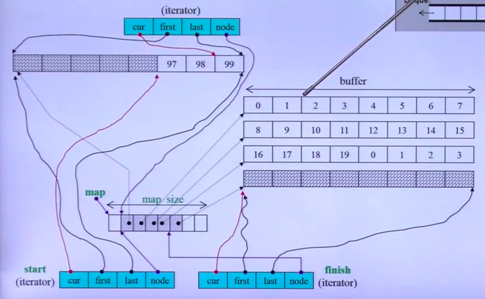
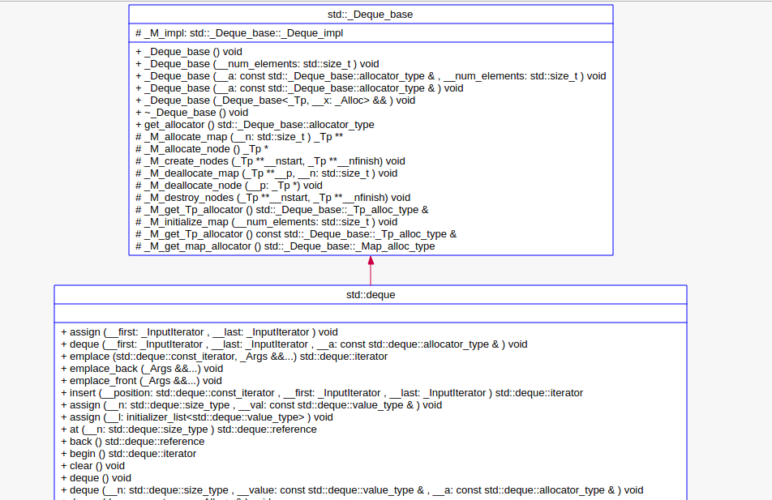
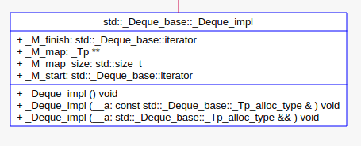
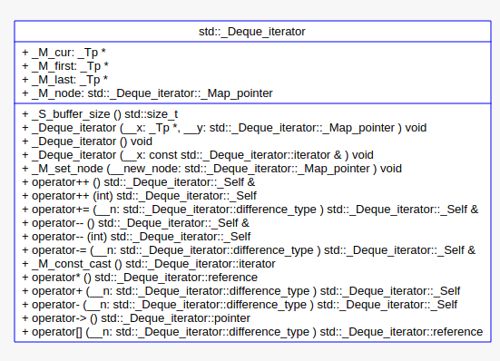

## 导语
`deque`是一个双向开口的分段连续空间，可以在头尾端进行元素的插入和删除。
`deque与vector`的区别：
> 1. `deque`允许常数时间内对首尾端进行插入和删除；
> 2. `deque`为分段连续空间，可以随意增加一段连续空间。

`vector`的内存不够时可以重新进行分配。

### `deque`的中控器
`deque`是一段连续的分段空间.
为管理分段连续空间引入了`map`,称之为中控器。
`map`是一段连续空间，期中每个元素指向缓冲区指针，缓冲区是`deque`存储数据的主体。

在图中，`buffer`称之为缓冲区，`map size`的一段连续空间为中控器。
#### 中控器
包含如下部分：
```cpp
_Tp **_M_map;// 指向buffer的指针
size_t _M_map_size; 
iterator _M_start;
iterator _M_stop;
```
`deque`继承自`_Deque_base`,`_Deque_base`包含有`_M_impl`:

通过上图可以看出，中控器是通过`_Deque_impl`实现的：


### 高端的迭代器

其中较为重要的成员：
```cpp
typedef _Tp **_Map_pointer;
_Tp *_M_cur; // 指向具体元素
_Tp *_M_first; // 指向第一个元素
_Tp *_M_last; // 指向最后一个元素
_Map_pointer _M_node; // 指向中控器， 二级指针
```
当迭代器执行`++`操作，当前`buffer`不满足要求时，需要一个指针能够回到中控器，取下一段`buffer`;
重置`_M_first和_M_last`指针，`_M_cur`指向新段`buffer`中指定位置。
#### `buffer`的计算方式：
在源码中根据传递的类型，如果传递的类型小于`512`字节，`buffersize = 512 / sizeof(_Tp)`;否则`buffersize = 1`。
```cpp
static size_t _S_buffer_size() _GLIBCXX_NOEXCEPT {
  return (_deque_buf_size(sizeof(_Tp)));
}
```
`_deque_buf_size`的实现：
```cpp
#ifndef _GLIBCXX_DEQUE_BUF_SIZE
#define _GLIBCXX_DEQUE_BUF_SIZE 512
#endif

inline size_t __deque_buf_size(size_t _size){
  return (_size < _GLIBCXX_DEQUE_BUF_SIZE ? size_t(_GLIBCXX_DEQUE_BUF_SIZE / _size ) : size_t(1));
}
```
在每个迭代器中都嵌入了下面五种`typedef`:
```cpp
typedef std::random_access_iterator_tag iterator_category;
typedef _Tp				value_type;
typedef _Ptr				pointer;
typedef _Ref				reference;
typedef ptrdiff_t			difference_type;
```
可以看出使用了`random_access_iterator_tag`的随机访问迭代器。
迭代器的操作符重载如下：
> 取值操作符
```cpp
reference operator*() const _GLIBCXX_NOEXEPT {
  // 先++， 判断是否到了buffer的末尾,如果到了末尾就跳到下一个buffer
  ++_M_cur;
  if(_M_cur == _M_last){
    _M_set_node(_M_node + 1);
    _M_cur = _M_first;
  }

  return (*this);
}

// 后置++操作符
_Self operator++(int) _GLIBCXX_NOEXECPT {
  _Self __tmp = *this;
  ++*this;
  return (__tmp);
}

// 前置--操作符
_Self &operator--() _GLINCXX_NOEXCEPT {
  // 先判断是否到了起始位置，如果到了，由于需要进行--操作，那么就应该进入前一个buffer
  if(_M_cur == _M_first) { 
    _M_set_node(_M_node - 1);
    _M_cur = _M_last;
  }
  --_M_cur;
  return (*this);
}

// 后置--操作符
_Self operator--(int) _GLIBCXX_NOEXCEPT {
  _Self tmp = *this; // 定义一个副本
  --*this; // 迭代器自减
  return (tmp);
}
```
> 跳跃n个距离操作符
```cpp

/*
* 实现随机取,迭代器可以直接跳跃n个距离
* 将迭代器前移n个距离,当n负值时就为下面的operator-=操作
*/
_Self &perator+=(difference_type __n) _GLIBCXX_NOEXCEPT {
  const difference_type __offset = __n + (_M_cur - _M_first);
  /*
    * 若前移n个距离后，目标依然在同一个缓冲区
    * 则直接前移n个距离
    */
  if(__offset >= 0 && __offset < differrence_type(_S_buffer_size())) { 
    _M_cur += n;
  }else {
     /*
      * 若前移n个距离后,目标超出了缓冲区范围
      * __offset>0   __offset / difference_type(_S_buffer_size())计算向后移动多少个缓冲区
      * __offset<=0  -difference_type((-__offset - 1) / _S_buffer_size()) - 1计算向前移动多少个缓冲区
      */
    const difference_type __node_offset = __offset > 0 ? __offset / difference_type(_S_buffer_size()) : -difference_type((-offset-1)/_S_buffer_size() - 1);
    // 调整到正确的缓冲区位置
    _M_set_node(_M_node + __node_offset);
    // 修改为正确的指针位置
    _M_cur = _M_first + (__offset - __node_offset * difference_type(_S_buffer_size()));
  }
  return (*this);
}
```
对`+=`操作符的实现：
```cpp
_Self operator+(difference_type __n) const _GLIBCXX_NOEXCEPT {
  _Self __tmp = *this;
  return (__tmp += __n);
}

_Self &operator-=(difference_type __n) const _GLIBCXX_NOEXCEPT {
  return (*this -= -n);
}

_Self operator-(difference_type __n) const _GLIBCXX_NOEXCEPT {
  _Self __tmp = *this;
  return (__tmp -= n);
}

// 返回指定位置元素实现随机存取
reference operator[](difference_type __n) const _GLIBCXX_NOEXCEPT {
  return (*(*this + __n));
}
```
> `buffer`跳跃
`_M_set_node`函数:在`buffer`之间进行跳跃，设置`_M_node, _M_last, _M_first`的指向。
```cpp
void _M_set_node(_Map_pointer __new_node) _GLIBCXX_NOEXCEPT { 
  _M_node = __new_node; // 指向新节点
  _M_first = *__new_node;
  _M_last = _M_first + difference_type(_S_buffer_size());
}
```
#### `deque`
`begin`函数,返回`_M_start`
```cpp
iterator begin() _GLIBCXX_NOEXCEPT {
  return (this->_M_impl._M_start);
}
```
`end`函数，返回`_M_finish`:
```cpp
iterator end() _GLIBCXX_NOEXCEPT {
  return (this->_M_impl._M_finish);
}
```
`size`函数
```cpp
size_type size() const _GLIBCXX_NOEXCEPT {
  return (this->_M_impl._M_finish - this->_M_impl._M_start);
}
```
`resize`函数：
根据传递的大小，如果超过了总的`size`,就重新分配扩充`__new_size - size() `空间，否则删除从`size() - __new_size`数据。
> 例如现在有20个空间，resize(12)，就会把后面8个空间数据删除及空间释放。

```cpp
void resize(size_type __new_size) {
  const size_type __len = size();
  if(__new_size > __len) {
    _M_default_apppend(__new_size - __len);
  }else if(__new_size < __len) {
    _M_erase_at_end(this->_M_start + difference_type(__new_size));
  }
} 
```
`empty`函数
```cpp
bool empty() const _GLIBCXX_NOEXCEPT {
  return (this->_M_start._M_finish == this->_M_start._M_start);
}
```
`back`函数
```cpp
reference back() _GLIBCXX_NOEXCEPT {
  iterator __tmp = end();
  --__tmp;
  return (*__tmp);
}
```
`push_front`函数
```cpp
void push_front(const value_type &__x){
  // 当前缓冲区空间可用
  if(this->_M_impl._M_start._M_cur != this->_M_impl._M_start._M_first) {
    this->_M_impl.construct(this->_M_impl._M_start._M_cur - 1, __x); // 构造对象
    --this->_M_impl._M_start._M_cur; // 调整指针位置
  } else {
    _M_push_front_aux(__x); // 分配一段新的空间
  }
}
```
`push_back`函数
```cpp
void push_back(const value_type &__x) {
  // 当前缓冲区可用
  if(this->_M_impl._M_start._M.cur != this->_M_impl._M_finish._M_last - 1) {
    this->_M_impl.constructor(this->_M_impl._M_finish._M_cur, __x);
    ++this->_M_impl._M_finish._M_cur;
  } else {
    _M_push_back_aux(__x);
  }
}
```
`insert`函数：
根据传递进来的迭代器位置，看是不在开头与结尾，如果是在开头直接调用push_front函数，结尾直接调push_back函数，否则在容器中直接插入元素。
```cpp
template <typename _Tp, typename _Alloc>
typename deque<_Tp, _Alloc>::iterator deque<_Tp, _Alloc>::insert(iterator __position, const value_type& __x)
{
        if (__position._M_cur == this->_M_impl._M_start._M_cur)   
    {
        push_front(__x);
        return this->_M_impl._M_start;
    }
        else if (__position._M_cur == this->_M_impl._M_finish._M_cur)
    {
        push_back(__x);
        iterator __tmp = this->_M_impl._M_finish;
        --__tmp;
        return __tmp;
    }
        else  //否则在容器直接插入数据
        return _M_insert_aux(__position._M_const_cast(), __x);
}


template<typename _Tp, typename _Alloc>
typename deque<_Tp, _Alloc>::iterator
deque<_Tp, _Alloc>::
_M_insert_aux(iterator __pos, const value_type& __x)
{
    value_type __x_copy = __x; // XXX copy
    difference_type __index = __pos - this->_M_impl._M_start;  //计算插入点之前元素个数
    if (static_cast<size_type>(__index) < size() / 2)   //若插入点之前的元素较少
        {
        push_front(_GLIBCXX_MOVE(front())); //先在容器头部插入与第一个元素相同的元素
        iterator __front1 = this->_M_impl._M_start;
        ++__front1;
        iterator __front2 = __front1;
        ++__front2;
        __pos = this->_M_impl._M_start + __index;
        iterator __pos1 = __pos;
        ++__pos1;
        _GLIBCXX_MOVE3(__front2, __pos1, __front1); // 元素搬移
        }
    else
    {
        push_back(_GLIBCXX_MOVE(back()));
        iterator __back1 = this->_M_impl._M_finish;
        --__back1;
        iterator __back2 = __back1;
        --__back2;
        __pos = this->_M_impl._M_start + __index;
        _GLIBCXX_MOVE_BACKWARD3(__pos, __back2, __back1);
    }
    *__pos = _GLIBCXX_MOVE(__x_copy);       // 在安插点上设定新值
    return __pos;
}
```
