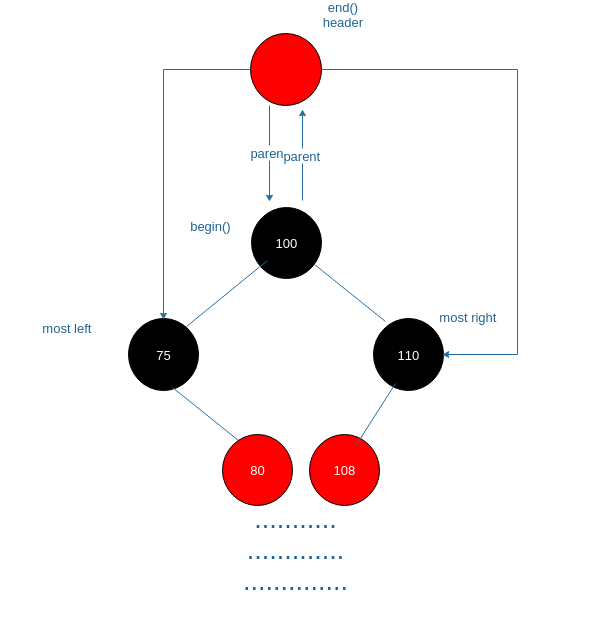
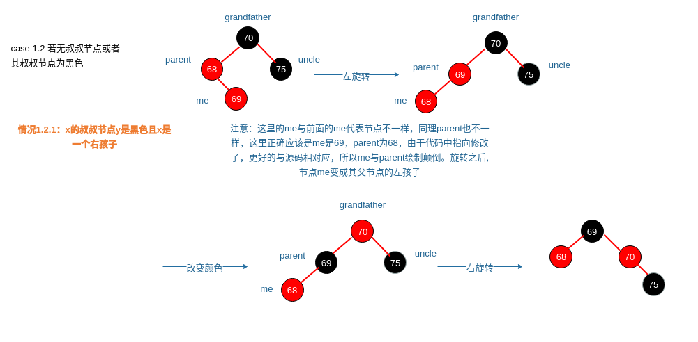
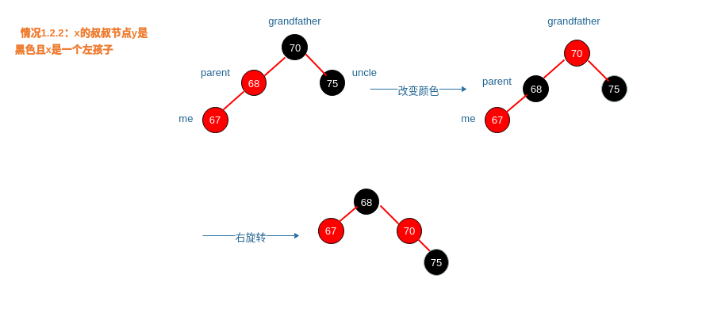
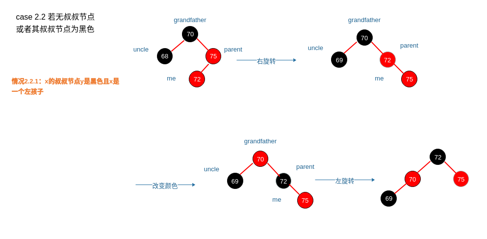
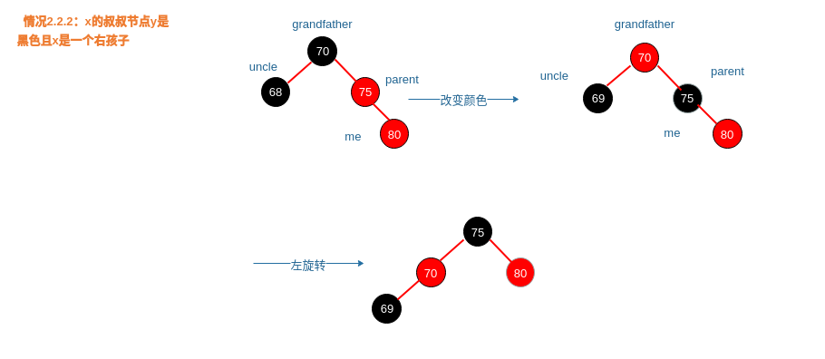

`STL`中`Red-black tree`（红黑树）`class`,用来当做SLT关系式容器（如s`et,multiset,map, multimap`）.里面所用的`insertion和deletion`方法以 《`Introduction to Algorithms`》一书为基础,但是有以下两点不同:

(1)`header`不仅指向`root`,也指向红黑树的最左节点,以便用常数时间实现`begin()`,并且也指向红黑树的最右边节点,以便` set`相关泛型算法（如`set_union`等等）可以有线性时间表现.

(2)当要删除的节点有两个子节点时，其后继节点连接到其位置，而不是被复制，因此，唯一使无效的迭代器是引用已删除节点的迭代器。

上述话翻译成图，如下，相比于普通的红黑树多了一个`header`节点，并且为红色。普通的红黑树是以`100`节点开始的，且满足下面五条性质：

* 每个节点或是红色的,或是黑色的.
* 根节点是黑色的.
* 每个叶节点（NULL）是黑色的.
* 如果一个节点是红色的，则它的两个孩子节点都是黑色的.
* 对每个节点，从该节点到其所有后代叶节点的简单路径上，均包含相同数目的黑色节点.

当然这里的rb_tree也是一样满足这几条性质，迭代器的begin指向红黑树根节点，也就是header的父亲，而end指向header节点。


1. 红黑树节点基类
红黑树基类，非常简单，在文件开头定义了颜色标记。

基类中包含了指向自己的指针，分别定义了`left、right、parent`，同时包含了一个颜色标记常量，而里面有两个核心函数，目的是获取红黑树中最小节点与最大节点。
对于二分搜索树获取最小节点就是左子树一直往下搜，最大节点就是右子树一直往下搜即可。
```cpp
// 颜色标记
enum _Rb_tree_color { _S_red = false, _S_black = true };

// 基类
struct _Rb_tree_node_base
{
// typedef重命名
typedef _Rb_tree_node_base* _Base_ptr;

// 颜色
_Rb_tree_color	_M_color;
// 指向父亲
_Base_ptr		_M_parent;
// 指向左孩子
_Base_ptr		_M_left;
// 指向右孩子
_Base_ptr		_M_right;

// 求红黑树的最小节点
static _Base_ptr
_S_minimum(_Base_ptr __x) _GLIBCXX_NOEXCEPT
{
    while (__x->_M_left != 0) __x = __x->_M_left;
    return __x;
}

// 求红黑树最大节点
static _Base_ptr
_S_maximum(_Base_ptr __x) _GLIBCXX_NOEXCEPT
{
    while (__x->_M_right != 0) __x = __x->_M_right;
    return __x;
}

};
```
### 红黑树节点
继承自红黑树基类
```cpp
template <typename _Val>
struct _Rb_tree_node : public _Rb_tree_node_base {
  typedef _Rb_tree_node<_Val> *_Link_type; // 节点指针，指向数据节点
  _Value _M_node_field; // 节点数据域，即关键字
};
```
### 红黑树迭代器
```cpp
template<typename _Tp>
struct _Rb_tree_iterator
{
    typedef _Tp  value_type;
    typedef _Tp& reference;
    typedef _Tp* pointer;

    typedef bidirectional_iterator_tag iterator_category;
    typedef ptrdiff_t                  difference_type;

    typedef _Rb_tree_iterator<_Tp>        _Self;
    typedef _Rb_tree_node_base::_Base_ptr _Base_ptr;
    typedef _Rb_tree_node<_Tp>*           _Link_type;

    _Base_ptr _M_node;
};
```
获取数据
```cpp
reference
operator*() const _GLIBCXX_NOEXCEPT
{ return *static_cast<_Link_type>(_M_node)->_M_valptr(); }

pointer
operator->() const _GLIBCXX_NOEXCEPT
{ return static_cast<_Link_type> (_M_node)->_M_valptr(); }

```
重载`++`操作符
```cpp
_Self&
operator++() _GLIBCXX_NOEXCEPT
{
    _M_node = _Rb_tree_increment(_M_node);
    return *this;
}
```
而_Rb_tree_increment底层是local_Rb_tree_increment，如下实现：
```cpp
static _Rb_tree_node_base *
local_Rb_tree_increment( _Rb_tree_node_base* __x ) throw ()
{
	if ( __x->_M_right != 0 )       /* 存在右子树,那么下一个节点为右子树的最小节点 */
	{
		__x = __x->_M_right;
		while ( __x->_M_left != 0 )
			__x = __x->_M_left;
	}else  {                        
        /* 不存在右子树,那么分为两种情况：自底往上搜索,当前节点为父节点的左孩子的时候,父节点就是后继节点； */
/* 第二种情况:_x为header节点了,那么_x就是最后的后继节点. 简言之_x为最小节点且往上回溯,一直为父节点的右孩子,直到_x变为父节点,_y为其右孩子 */
		_Rb_tree_node_base *__y = __x->_M_parent;
		while ( __x == __y->_M_right )
		{
			__x	= __y;
			__y	= __y->_M_parent;
		}
		if ( __x->_M_right != __y )
			__x = __y;
	}
	return (__x);
}
```
重载`--`操作符
```cpp
_Self&
operator--() _GLIBCXX_NOEXCEPT
{
	_M_node = _Rb_tree_decrement(_M_node);
    return *this;
}
```
同理，而_Rb_tree_decrement底层是local_Rb_tree_decrement，如下实现：
```cpp
static _Rb_tree_node_base *
local_Rb_tree_decrement( _Rb_tree_node_base * __x )
throw ()
{
/* header节点 */
	if ( __x->_M_color ==
	     _S_red
	     && __x
	     ->_M_parent->_M_parent == __x )
		__x = __x->_M_right;
	else if ( __x->_M_left != 0 ) /* 左节点不为空,返回左子树中最大的节点 */
	{
		_Rb_tree_node_base *__y = __x->_M_left;
		while ( __y->_M_right != 0 )
			__y = __y->_M_right;
		__x = __y;
	}else  {
/* 自底向上找到当前节点为其父节点的右孩子,那么父节点就是前驱节点 */
		_Rb_tree_node_base *__y = __x->_M_parent;
		while ( __x == __y->_M_left )
		{
			__x	= __y;
			__y	= __y->_M_parent;
		}
		__x = __y;
	}
	return
		(__x);
}
```
重载==与!=操作符，直接判断节点指针是否相等。
```cpp
bool
operator==(const _Self& __x) const _GLIBCXX_NOEXCEPT
{ return _M_node == __x._M_node; }

bool
operator!=(const _Self& __x) const _GLIBCXX_NOEXCEPT
{ return _M_node != __x._M_node; }

```
黑色节点统计：
```cpp
unsigned int
_Rb_tree_black_count(const _Rb_tree_node_base *__node,
                     const _Rb_tree_node_base *__root) throw() {
    if (__node == 0)
        return 0;
    unsigned int __sum = 0;
    do {
        if (__node->_M_color == _S_black)
            ++__sum;
        if (__node == __root)
            break;
        __node = __node->_M_parent;
    } while (1);
    return __sum;
}
```
红黑树操作
```cpp
template<typename _Key, typename _Val, typename _KeyOfValue,
           typename _Compare, typename _Alloc = allocator<_Val> >
class _Rb_tree
{
    
protected:
    typedef _Rb_tree_node_base* 		_Base_ptr;

 template<typename _Key_compare, 
    bool _Is_pod_comparator = __is_pod(_Key_compare)>
    struct _Rb_tree_impl : public _Node_allocator
    {
	  _Key_compare		_M_key_compare;
	  _Rb_tree_node_base 	_M_header;
	  size_type 		_M_node_count; // Keeps track of size of tree.

	  _Rb_tree_impl()
	  : _Node_allocator(), _M_key_compare(), _M_header(),
	    _M_node_count(0)
	  { _M_initialize(); }

	  _Rb_tree_impl(const _Key_compare& __comp, const _Node_allocator& __a)
	  : _Node_allocator(__a), _M_key_compare(__comp), _M_header(),
	    _M_node_count(0)
	  { _M_initialize(); }

	private:
	  void
	  _M_initialize()
	  {
	    this->_M_header._M_color = _S_red;
	    this->_M_header._M_parent = 0;
	    this->_M_header._M_left = &this->_M_header;
	    this->_M_header._M_right = &this->_M_header;
	  }	 
  
    };
public: 
    typedef _Rb_tree_iterator<value_type>       iterator;
    typedef std::reverse_iterator<iterator>     reverse_iterator; 
private:
_Rb_tree_impl<_Compare> _M_impl;
};
```
获取红黑树根节点、最左与最右节点
```cpp
// 图中100 节点
 _Base_ptr&
_M_root() _GLIBCXX_NOEXCEPT
{ return this->_M_impl._M_header._M_parent; }

// 图中most left标记
_Base_ptr&
_M_leftmost() _GLIBCXX_NOEXCEPT
{ return this->_M_impl._M_header._M_left; }


// 图中most right标记
 _Base_ptr&
_M_rightmost() _GLIBCXX_NOEXCEPT
{ return this->_M_impl._M_header._M_right; }
 _Link_type

 // 图中begin()标记
_M_begin() _GLIBCXX_NOEXCEPT
{ return static_cast<_Link_type>(this->_M_impl._M_header._M_parent); }

// 图中end()标记
_Link_type
_M_end() _GLIBCXX_NOEXCEPT
{ return reinterpret_cast<_Link_type>(&this->_M_impl._M_header); }

```
### 红黑树插入
旋转过程
左旋转是将该节点的右节点设置为它的父节点，该节点将变成刚才右节点的左孩子

直接看源码中的图与代码对比即可。

在tree.cc源码中实现函数为local_Rb_tree_rotate_left与local_Rb_tree_rotate_right。 下面我们将源码进行剖析成比较容易理解的代码，具体见注释。 大家会发现函数名与变量名与源码不同，是因为下面是当时自己实现的，但是不影响源码阅读，就直接拿来对比了。
```cpp
/**
* 当前节点的左旋转过程
* 将该节点的右节点设置为它的父节点，该节点将变成刚才右节点的左孩子
* @param _x
*/
//    _x                      _y
//  /   \     左旋转         /  \
// T1   _y   --------->   _x    T3
//     / \              /   \
//    T2 T3            T1   T2
void leftRotate(Node *_x) {
    // step1 处理_x的右孩子
    // 右节点变为_x节点的父亲节点,先保存一下右节点
    Node *_y = _x->right;
    // T2变为node的右节点
    _x->right = _y->left;
    if (NULL != _y->left)
        _y->left->parent = _x;

    // step2 处理_y与父亲节点关系
    _y->parent = _x->parent;      // 原来_x的父亲变为_y的父亲
    // 说明原来_x为root节点,此时需要将_y设为新root节点
    // 或者判断NULL == _y->parent
    if (_x == root)
        root = _y;
    else if (_x == _x->parent->left)    // 原_x的父节点的左孩子连接新节点_y
        _x->parent->left = _y;
    else // 原_x的父节点的右孩子连接新节点_y
        _x->parent->right = _y;

    // step3 处理_x与_y关系
    _y->left = _x;      // _y的左孩子为_x
    _x->parent = _y;    // _x的父亲是_y
}
```
同理，右旋转如下：
```cpp
//        _x                      _y
//      /   \     右旋转         /  \
//     _y    T2 ------------->  T0  _x
//    /  \                         /  \
//   T0  T1                       T1  T2
void rightRotate(Node *_x) {
    // step1 处理_x的左孩子
    // 左节点变为_x节点的父亲节点,先保存一下左节点
    Node *_y = _x->left;
    // T1变为_x的左孩子
    _x->left = _y->right;
    if (NULL != _y->right)
        _y->right->parent = _x;

    // step2 处理_y与父节点之间的关系
    // 或者判断_x->parent==NULL
    if (_x == root)
        root = _y;
    else if (_x == _x->parent->right)
        _x->parent->right = _y;
    else
        _x->parent->left = _y;

    // step3 处理_x与_y关系
    _y->right = _x;     // _y的右孩子为_x
    _x->parent = _y;    // _x的父亲是_y
}
```
case 1.1: 父节点为红色且其叔叔节点也为红色，则将父亲、叔叔置为黑色，祖父置为红色。


case 1.2 若无叔叔节点或者其叔叔节点为黑色分为下面两种：
1. x的叔叔节点y是黑色且x是一个右孩子

2. x的叔叔节点y是黑色且x是一个左孩子


```cpp
_Rb_tree_node_base *const __y = __xpp->_M_right;    // 得到叔叔节点
if (__y && __y->_M_color == _S_red)     // case1: 叔叔节点存在，且为红色
{
    /**
        * 解决办法是：颜色翻转，父亲与叔叔的颜色都变为黑色,祖父节点变为红色,然后当前节点设为祖父，依次网上来判断是否破坏了红黑树性质
        */
    __x->_M_parent->_M_color = _S_black;    // 将其父节点改为黑色
    __y->_M_color = _S_black;               // 将其叔叔节点改为黑色
    __xpp->_M_color = _S_red;               // 将其祖父节点改为红色
    __x = __xpp;                            // 修改_x,往上回溯
} else {        // 无叔叔或者叔叔为黑色
    if (__x == __x->_M_parent->_M_right) {          // 当前节点为父亲节点的右孩子
        __x = __x->_M_parent;
        local_Rb_tree_rotate_left(__x, __root);     // 以父节点进行左旋转
    }
    // 旋转之后,节点x变成其父节点的左孩子
    __x->_M_parent->_M_color = _S_black;            // 将其父亲节点改为黑色
    __xpp->_M_color = _S_red;                       // 将其祖父节点改为红色
    local_Rb_tree_rotate_right(__xpp, __root);      // 以祖父节点右旋转
}
```
case 2.1: 父节点为红色且其叔叔节点也为红色，则将父亲、叔叔置为黑色，祖父置为红色。

case 2.2 若无叔叔节点或者其叔叔节点为黑色

情况2.2.1：x的叔叔节点y是黑色且x是一个左孩子

```cpp
_Rb_tree_node_base *const __y = __xpp->_M_left; // 保存叔叔节点
if (__y && __y->_M_color == _S_red) {       // 叔叔节点存在且为红色
    __x->_M_parent->_M_color = _S_black;    // 父亲节点改为黑色
    __y->_M_color = _S_black;               // 祖父节点改为红色
    __xpp->_M_color = _S_red;
    __x = __xpp;
} else {        // 若无叔叔节点或者其叔叔节点为黑色
    if (__x == __x->_M_parent->_M_left) {   // 当前节点为父亲节点的左孩子
        __x = __x->_M_parent;
        local_Rb_tree_rotate_right(__x, __root);    // 以父节点右旋转
    }
    __x->_M_parent->_M_color = _S_black;        // 父节点置为黑色
    __xpp->_M_color = _S_red;                   // 祖父节点置为红色
    local_Rb_tree_rotate_left(__xpp, __root);   // 左旋转
}
```
_Rb_tree_insert_and_rebalance完整解析：
```cpp
void
_Rb_tree_insert_and_rebalance(const bool __insert_left,
                              _Rb_tree_node_base *__x,
                              _Rb_tree_node_base *__p,
                              _Rb_tree_node_base &__header) throw() {
    _Rb_tree_node_base * &__root = __header._M_parent;

    // Initialize fields in new node to insert.
    __x->_M_parent = __p;
    __x->_M_left = 0;
    __x->_M_right = 0;
    __x->_M_color = _S_red;

    // 处理__header部分
    // Insert.
    // Make new node child of parent and maintain root, leftmost and
    // rightmost nodes.
    // N.B. First node is always inserted left.
    if (__insert_left) {
        __p->_M_left = __x; // also makes leftmost = __x when __p == &__header

        if (__p == &__header) {
            __header._M_parent = __x;
            __header._M_right = __x;
        } else if (__p == __header._M_left)
            __header._M_left = __x; // maintain leftmost pointing to min node
    } else {
        __p->_M_right = __x;

        if (__p == __header._M_right)
            __header._M_right = __x; // maintain rightmost pointing to max node
    }

 // Rebalance.
    while (__x != __root
           && __x->_M_parent->_M_color == _S_red)   // 若新插入节点不是为RB-Tree的根节点，且其父节点color属性也是红色,即违反了性质4.
    {
        _Rb_tree_node_base *const __xpp = __x->_M_parent->_M_parent;        // 祖父节点

        if (__x->_M_parent == __xpp->_M_left)   // 父亲是祖父节点的左孩子
        {
            _Rb_tree_node_base *const __y = __xpp->_M_right;    // 得到叔叔节点
            if (__y && __y->_M_color == _S_red)     // case1: 叔叔节点存在，且为红色
            {
                /**
                 * 解决办法是：颜色翻转，父亲与叔叔的颜色都变为黑色,祖父节点变为红色,然后当前节点设为祖父，依次网上来判断是否破坏了红黑树性质
                 */
                __x->_M_parent->_M_color = _S_black;    // 将其父节点改为黑色
                __y->_M_color = _S_black;               // 将其叔叔节点改为黑色
                __xpp->_M_color = _S_red;               // 将其祖父节点改为红色
                __x = __xpp;                            // 修改_x,往上回溯
            } else {        // 无叔叔或者叔叔为黑色
                if (__x == __x->_M_parent->_M_right) {          // 当前节点为父亲节点的右孩子
                    __x = __x->_M_parent;
                    local_Rb_tree_rotate_left(__x, __root);     // 以父节点进行左旋转
                }
                // 旋转之后,节点x变成其父节点的左孩子
                __x->_M_parent->_M_color = _S_black;            // 将其父亲节点改为黑色
                __xpp->_M_color = _S_red;                       // 将其祖父节点改为红色
                local_Rb_tree_rotate_right(__xpp, __root);      // 以祖父节点右旋转
            }
        } else {        // 父亲是祖父节点的右孩子
            _Rb_tree_node_base *const __y = __xpp->_M_left; // 保存叔叔节点
            if (__y && __y->_M_color == _S_red) {       // 叔叔节点存在且为红色
                __x->_M_parent->_M_color = _S_black;    // 父亲节点改为黑色
                __y->_M_color = _S_black;               // 祖父节点改为红色
                __xpp->_M_color = _S_red;
                __x = __xpp;
            } else {        // 若无叔叔节点或者其叔叔节点为黑色
                if (__x == __x->_M_parent->_M_left) {   // 当前节点为父亲节点的左孩子
                    __x = __x->_M_parent;
                    local_Rb_tree_rotate_right(__x, __root);    // 以父节点右旋转
                }
                __x->_M_parent->_M_color = _S_black;        // 父节点置为黑色
                __xpp->_M_color = _S_red;                   // 祖父节点置为红色
                local_Rb_tree_rotate_left(__xpp, __root);   // 左旋转
            }
        }
    }
    //若新插入节点为根节点,则违反性质2
    //只需将其重新赋值为黑色即可
    __root->_M_color = _S_black;
}
```


