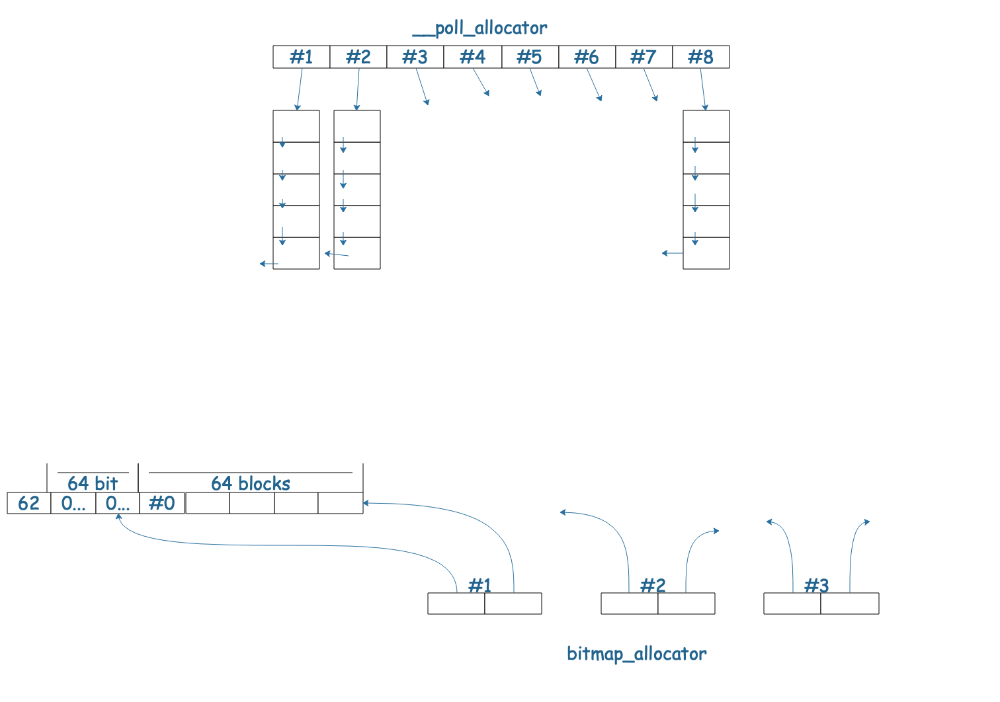
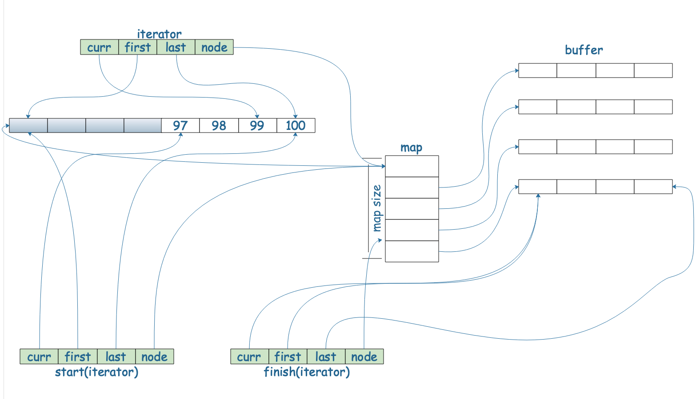

# `STL`与泛华编程
## 使用分配器`allocator`
```cpp
/**
 * @file allocatordemo.cc
 * @author koritafei (koritafei@gmail.com)
 * @brief
 * @version 0.1
 * @date 2021-09-17
 *
 * @copyright Copyright (c) 2021
 *
 */

#include <bits/types/clock_t.h>

#include <cstddef>
#include <cstdio>
#include <cstdlib>
#include <ctime>
#include <exception>
#include <ext/array_allocator.h>
#include <ext/bitmap_allocator.h>
#include <ext/debug_allocator.h>
#include <ext/malloc_allocator.h>
#include <ext/mt_allocator.h>
#include <ext/new_allocator.h>
#include <ext/pool_allocator.h>
#include <iostream>
#include <list>
#include <memory>
#include <stdexcept>
#include <string>

namespace TestAllocator {

void test_list_with_spectial_allocator() {
  std::cout << "test_list_with_spectial_allocator() ......... " << std::endl;

  std::list<std::string, std::allocator<std::string>>              c1;
  std::list<std::string, __gnu_cxx::malloc_allocator<std::string>> c2;
  std::list<std::string, __gnu_cxx::new_allocator<std::string>>    c3;
  std::list<std::string, __gnu_cxx::__pool_alloc<std::string>>     c4;
  std::list<std::string, __gnu_cxx::__mt_alloc<std::string>>       c5;
  std::list<std::string, __gnu_cxx::bitmap_allocator<std::string>> c6;

  int  choice;
  long value;
  std::cout << "select : ";
  std::cin >> choice;

  if (0 != choice) {
    std::cout << "how many elements : ";
    std::cin >> value;
  }

  char    buf[10];
  clock_t time_start = clock();

  for (long i = 0; i < value; i++) {
    try {
      snprintf(buf, 10, "%d", i);

      switch (choice) {
        case 1:
          c1.push_back(std::string(buf));
          break;
        case 2:
          c2.push_back(std::string(buf));
          break;
        case 3:
          c3.push_back(std::string(buf));
          break;
        case 4:
          c4.push_back(std::string(buf));
          break;
        case 5:
          c5.push_back(std::string(buf));
          break;
        case 6:
          c6.push_back(std::string(buf));
          break;
        default:
          break;
      }

    } catch (std::exception &p) {
      std::cout << "i = " << i << " " << p.what() << std::endl;
      abort();
    }
  }
  std::cout << "a lot of push_back(), milli-seconds: " << (clock() - time_start)
            << std::endl;
}

}  // namespace TestAllocator

int main(int argc, char **argv) {
  TestAllocator::test_list_with_spectial_allocator();
}
```

### `vector`

两倍增长，如果没有增长空间，宣布`vector`操作失败。
`value_type`等类型的定义的作用：
主要用于方便返回容器中的类型，便于对处理不同容器的函数进行统一的封装。
如：
```cpp
/**
 * @file typedemo.cc
 * @author koritafei (koritafei@gmail.com)
 * @brief
 * @version 0.1
 * @date 2021-09-18
 *
 * @copyright Copyright (c) 2021
 *
 */

#include <cstddef>
#include <iostream>

template <typename T>
class Bag {
public:
  typedef T           value_type;
  typedef value_type* pointer;
  typedef value_type& reference;
  typedef size_t      size_type;

  Bag(T a) : val(a) {
  }

  T getVal() const {
    return val;
  }

private:
  T val;
};

template <typename T>
class Box {
public:
  typedef T           value_type;
  typedef value_type* pointer;
  typedef value_type& reference;
  typedef size_t      size_type;

  Box(T val) : val(val) {
  }

  T getVal() const {
    return val;
  }

private:
  T val;
};

template <typename Container>
typename Container::value_type unpack(Container c) {
  return c.getVal();
}

int main(int argc, char** argv) {
  Box<int>  a(100);
  Bag<char> b('a');
  std::cout << unpack(a) << std::endl;
  std::cout << unpack(b) << std::endl;
}
```
对两个不同的实现类`Box`与`Bag`时，其定义的获取函数等相同时，可以封装单独的类/函数，处理这个两个类的相同逻辑。通过`value_type`的类型定义，避免了不同类的相似操作重复编写代码。

`vector`简单定义：
```cpp

#include <cstddef>
template <class T, class Alloc = alloc>
class Vector {
public:
  typedef T           value_type;  // 用于返回值类型
  typedef value_type* iterator;
  typedef value_type& reference;
  typedef size_t      size_type;

  iterator begin() {
    return start;
  }

  iterator end() {
    return finish;
  }

  size_type size() const {
    return size_type(end() - begin());
  }

  size_type capacity() const {
    return size_type(end_of_storage - begin());
  }

  bool empty() const {
    return begin() == end();
  }

  reference operator[](size_type n) {
    return *(begin() + n);
  }

  reference front() {
    return *begin();
  }

  reference back() {
    return *(end() - 1);
  }

protected:
  iterator start;
  iterator finish;
  iterator end_of_storage;
};
```
### `deque`

```cpp

#include <cstddef>

template <class T, class Ref, class Ptr, size_t BufSiz>
struct __deque_iterator {
  typedef T      value_type;
  typedef Ptr    pointer;
  typedef Ref    reference;
  typedef size_t size_type;
  typedef T**    map_pointer;

  typedef __deque_iterator self;

  T*          cur;
  T*          first;
  T*          last;
  map_pointer node;
};

template <class T, class Alloc = alloc, size_t BufSiz = 0>
class deque {
public:
  typedef T                                   value_type;
  typedef value_type*                         pointer;
  typedef value_type&                         reference;
  typedef __deque_iterator<T, T&, T*, BufSiz> iterator;

  typedef size_t size_type;

protected:
  typedef pointer* map_pointer;

  iterator    start;
  iterator    finish;
  map_pointer map;
  size_type   map_size;
};
```
`deque`插入元素：
1. 如果在`start`位置插入元素，直接插入`start.push_front()`;
2. 如果在`finish`位置插入元素，直接插入`finish.push_back()`;
3. 如果不在`start与finish`处：
   * 如果插入位置，前半部分元素较少，则`push_front()`;
   * 如果插入位置，后半部分元素较少，则`push_back()`.

### `RB-Tree`
平衡二叉搜索树，有利于`search和insert`.
```cpp

template <typename Key,
          typename Value,
          typename KeyOfValue,
          typename Compare,
          typename Alloc = alloc>

class rb_tree {
protected:
  typedef size_t                size_type;
  typedef __rb_tree_node<Value> rb_tree_node;

public:
  typedef rb_tree_node* link_type;

protected:
  size_type node_count;  // rb tree 大小
  link_type head;
  Compare   key_compare;  // key 大小比较准则
};
````
### `set与multiset`
```cpp

template <class Key, class Compare = less<key>, class Alloc = alloc>
class set {
public:
  typedef Key key_type;
  typedef Key value_type;

  typedef Compare key_compare;
  typedef Compare value_compare;

private:
  typedef rb_tree<key_type,
                  value_type,
                  identify<value_type>,
                  key_compare,
                  Alloc>
      rep_type;

  rep_type t;

public:
  typedef typename rep_type::const_iterator iterator;
}; 
```
### `map与multimap`
```cpp
template <class Key, class T, class Compare = less<key>, class Alloc = alloc>
class map {
public:
  typedef Key                key_type;
  typedef T                  data_type;
  typedef T                  mapped_type;
  typedef pair<const Key, T> value_type;
  typedef Compare            key_compare;

private:
  typedef rb_tree<key_type,
                  value_type,
                  select1st<value_type>,
                  key_compare,
                  Alloc>
           req_type;
  req_type t;

public:
  typedef typename req_type::iterator iterator;
};
```
在`map和set`中，都是通过，`key|value`组合成其值。

### `iterator`
五种`iterator_category`:
```cpp
struct input_iterator_tag{};
struct output_iterator_tag{};
struct farward_iterator_tag : public input_iterator_tag{};
struct bidirectional_iterator_tag : public farward_iterator_tag{};
struct random_access_iterator_tag : public bidirectional_iterator_tag{};
```
### 仿函数
结构：
```cpp
struct name (: public base class) {
  return_val operator()(paramers){
    // operator 
  }
} 
```
`STL`仿函数适配组件：
```cpp
template <class Arg, class Result>
struct unary_function {
  typedef Arg    argument_type;
  typedef Result result_type;
};

template <class Arg1, class Arg2, class Result>
struct binary_function {
  typedef Arg1 first_argument_type;
  typedef Arg2 second_argument_type;
  typedef Result result_type;
};
```
只有上述两个`struct`，不在继承体系中时，大小为`1`;
在继承体系中，大小为`0`.
### `hashfunc`
```cpp
/**
 * @file hashfunc.cc
 * @author koritafei (koritafei@gmail.com)
 * @brief
 * @version 0.1
 * @date 2021-09-21
 *
 * @copyright Copyright (c) 2021
 *
 */

#include <boost/functional/hash.hpp>
#include <iostream>

template <typename T>
inline void hash_combine(size_t &seed, const T &val) {
  // 利用0x9e3779b9做hash分散
  seed ^= boost::hash<T>()(val) + 0x9e3779b9 + (seed << 6) + (seed >> 2);
}

template <typename T>
inline void hash_val(size_t &seed, const T &val) {
  boost::hash_combine(seed, val);
}

template <typename T, typename... Types>
inline void hash_val(size_t &seed, const T &val, const Types &...args) {
  hash_combine(seed, val);
  hash_val(seed, args...);
}

template <typename... Types>
inline size_t hash_val(const Types &...args) {
  size_t seed = 0;
  hash_val(seed, args...);
  return seed;
}

class Customer {
public:
  std::string fname;
  std::string lname;
  int         no;

  Customer(std::string fname, std::string lname, int no)
      : fname(fname), lname(lname), no(no) {
  }
};

class CustomerHash {
public:
  size_t operator()(const Customer &c) const {
    return hash_val(c.fname, c.lname, c.no);
  }
};

int main(int argc, char **argv) {
  CustomerHash hh;
  std::cout << hh(Customer("Ace", "Hou", 1L)) % 11 << std::endl;
  std::cout << hh(Customer("Sabri", "Hou", 2L)) % 11 << std::endl;
  std::cout << hh(Customer("Stacy", "Chen", 3L)) % 11 << std::endl;
  std::cout << hh(Customer("Mike", "Tseng", 4L)) % 11 << std::endl;
  std::cout << hh(Customer("Paili", "Chen", 5L)) % 11 << std::endl;
  std::cout << hh(Customer("Light", "Shiau", 6L)) % 11 << std::endl;
}
```


